<!-- Copyright (c) 2026 Intel Corporation -->
<!-- SPDX-License-Identifier: Apache-2.0 -->

# Pressure Algorithm

How SmarTune turns raw kernel signals into a **pressure score** and a
**pressure level** (`low / medium / high / critical`) that drives auto-throttling
and staged restore.

There are **two independent channels**, each with its own score, bands and level state:
the **system** channel, driven mostly by memory, and the **disk-IO** channel, which
decides `io.max` throttling on its own. They share the input plumbing, the
self-inflicted discount and the smoothing machinery — nothing else. That split is
what this document is organised around:

| | |
|---|---|
| [**Part I — Shared machinery**](#part-i--shared-machinery) | the pipeline, the inputs, the self-inflicted discount, and the score → level filter that both channels run |
| [**Part II — The system channel**](#part-ii--the-system-channel) | the memory sigmoid, the weighted average, and why memory alone can reach `critical` |
| [**Part III — The disk-IO channel**](#part-iii--the-disk-io-channel) | the per-disk USE model, the noisy-OR, the PSI gate, and what a `critical` disk level does |
| [**Appendix — Parameter reference**](#appendix--parameter-reference) | every knob, which direction moves it, and a tuning cheat-sheet |

Where the code lives:

- Score math, both channels: [`monitor/pressure.py`](../monitor/pressure.py) (`PressureAnalyzer`)
- Per-disk USE model: [`monitor/disk_pressure.py`](../monitor/disk_pressure.py) (`DiskIOMonitor`)
- Signal collection & attribution: [`monitor/psi.py`](../monitor/psi.py) (`PSIMonitor`)
- Orchestration / refresh cadence: [`monitor/monitor_api.py`](../monitor/monitor_api.py) (`SystemPressureMonitor`)

> Figures are regenerated by [`pressure_model_figures.py`](pressure_model_figures.py)
> (`python3 docs/pressure_model_figures.py`). Re-run it whenever a default changes.

---

# Part I — Shared machinery

## 1. Pipeline at a glance

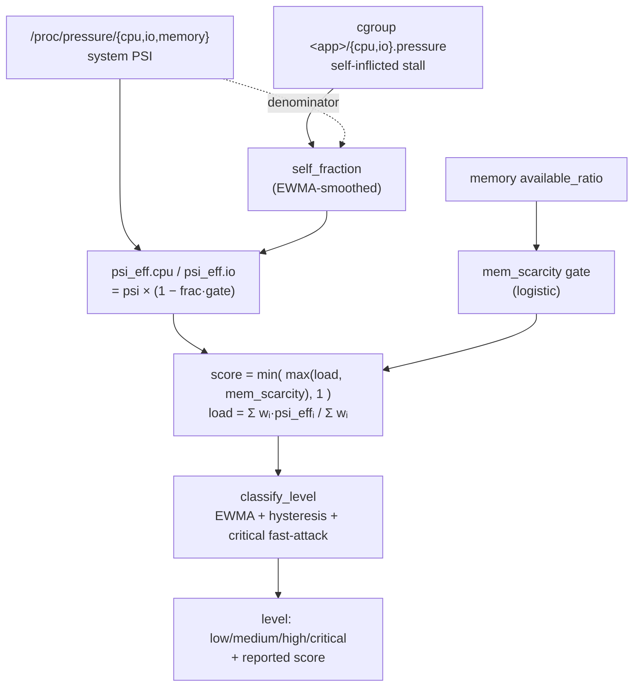

Every ~5 s (tightening to ~2 s near OOM — see §4) the monitor samples the signals,
computes a **raw score**, then smooths it into a **level**. The raw score reacts
instantly; the level is deliberately stabilized so the balancer's restore timer can
converge.

The same tick also evaluates the disk-IO channel, which has its own inputs, bands and
level — see Part III.

---

## 2. Inputs

| Symbol | Source | Meaning |
|---|---|---|
| `psi.cpu`, `psi.io`, `psi.memory` | `/proc/pressure/*` (`some`, rolling avg) | fraction of time **some** task stalled on that resource, `0..1` |
| `self_fraction.cpu/io` | per-cgroup `*.pressure` ÷ system PSI | share of the stall caused by the **already-limited** app(s), `0..1` |
| `available_ratio` | `MemAvailable / MemTotal` | free-memory ratio, `0..1` |
| `weights` | `config.yaml` → `weights` | relative importance, shipped `cpu:1, memory:7, io:2` |
| `thresholds` | `config.yaml` → `thresholds` | level **entry** cut-offs, shipped `0.4 / 0.6 / 0.8 / 1.0` — see the band table in §4 |

**Why PSI and not CPU%?** PSI measures *stall* (contention), not utilization. CPU at
100% with no one waiting is benign; PSI stays low. That distinction is the whole point
of the model — see §7.

---

## 3. Self-inflicted discount (CPU / IO)

When an app is **already rate-limited** but still the top consumer, throttling it
*inflates* PSI (its tasks stall against their own `cpu.max` / `io.max`) even though the
rest of the machine has headroom. We remove only the portion of the stall that the
limited app itself caused.

$$
p^{\mathrm{eff}}_{r} = p_{r}\;\bigl(1 - f_{r}g\bigr)
\qquad r \in \{\text{cpu}, \text{io}\}
$$

where $p^{\mathrm{eff}}_{r}\equiv$ `psi_eff.r`, $p_r\equiv$ `psi.r`, $f_r\equiv$ `self_fraction.r`, and $g\equiv$ `gate`.

- `gate` = `_CPU_IO_SELF_GATE` (default **0.7**).
- `self_fraction` is only non-zero when a limited app is dominant; otherwise no discount.

**`self_fraction` itself** (`PSIMonitor.get_self_inflicted_fraction`):

$$
f_{r} = \min\!\Bigl(1,\ \frac{\sum_{\mathrm{limited\ cg}} q_{cg,r}}{q_{\mathrm{sys},r}}\Bigr)
$$

where $q_{cg,r}$ and $q_{\mathrm{sys},r}$ are cgroup/system stall-rate deltas for resource $r$.

computed from the `some total` delta of each cgroup's `*.pressure` file vs the system
PSI file, then **EWMA-smoothed** (§4). It is attribution by *pressure*, not throughput —
a byte/CPU-time share was tried and was worse for stall-driven loads (e.g. `stress --io`
generates IO-wait via `sync()` while moving ~no bytes, collapsing a byte-share to zero).

Both channels use it: the system channel discounts `psi.cpu` / `psi.io` here, the disk
channel discounts the io PSI that feeds its own gate (§13.1).

### Effect of `_CPU_IO_SELF_GATE`

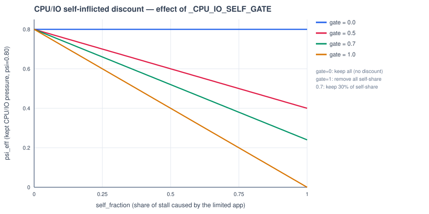

| gate | behaviour | risk |
|---|---|---|
| `0.0` | keep all stall (no discount) | post-limit score stays high → keeps re-limiting |
| `0.7` (default) | remove 70 % of the self-share | lands post-limit pressure in the stable medium band |
| `1.0` | remove all self-share | can drop to "low" → premature full restore → limit/restore **flapping** |

Lower gate → less discount → higher score. Higher gate → more discount → lower score.

---

## 4. Level classification — smoothing, hysteresis, fast-attack

`calculate_pressure_score` returns the **raw** score; `classify_level` turns a stream of
raw scores into a **stable level** plus the smoothed score that is reported to the UI.

**The bands.** `thresholds` are *entry* thresholds — `get_pressure_level` returns level `X`
for `score >= thresholds[X]` — so with the shipped `0.4 / 0.6 / 0.8 / 1.0` the bands are:

| score | level |
|---|---|
| `[0, 0.6)` | `low` |
| `[0.6, 0.8)` | `medium` |
| `[0.8, 1.0)` | `high` |
| `1.0` | `critical` |

Two consequences that are easy to get wrong: a score of **0.5 is still `low`**, not medium;
and `critical` is the top edge only, reachable because the score is rounded to 2 dp
(`round(score, 2)`), so a scarcity of 0.997 does land on `critical`. `thresholds.low` has
**no effect on the system level** (both branches below `medium` return `low`); it is only
load-bearing on the disk channel, where `disk_thresholds.low` is the start of the
saturation ramp (§13).
Both channels run this same filter, on **separate state** — the system channel on
`_score_smoothed` / `_last_level`, the disk channel on `_disk_score_smoothed` /
`_disk_last_level` — so a disk transition never disturbs the system level or vice versa.

**(a) EWMA smoothing** of the sub-critical score:

$$
s_t = \alpha\,x_t + (1-\alpha)\,s_{t-1},\qquad \alpha = 0.3
$$

where `alpha` is configured by `_SCORE_EWMA_ALPHA` in `pressure.py`.

A first-order IIR low-pass filter. Weight on the sample `k` ticks ago is `α(1−α)^k`
(geometric decay); effective memory ≈ `1/α ≈ 3.3` ticks (~15 s at a 5 s cadence).

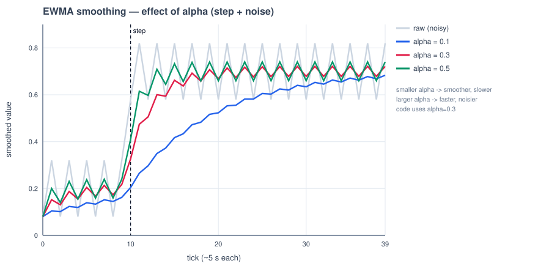

- Smaller `α` → smoother but slower to react.
- Larger `α` → faster but noisier.
- The raw score's tick-to-tick swing (cpu PSI jumping 0.2↔0.85) is what smoothing removes;
  without it the level chattered across a threshold every few seconds and reset the
  balancer's restore timer.

> **Adaptive / sigmoid α was evaluated and rejected**: on real logs the noise is
> stationary, so an adaptive α averaged 0.335 ≈ the fixed 0.30 with no gain, and would
> re-introduce chatter by chasing normal noise. Fixed α + hysteresis + fast-attack covers
> the one regime change that matters (critical) directly.

**(b) Hysteresis** — downgrades are sticky, upgrades are immediate:

- To *enter* a higher level: cross its threshold (immediate).
- To *leave* the current level downward: the smoothed score must fall a full
  `_LEVEL_HYSTERESIS` (**0.05**) **below** that level's entry threshold.

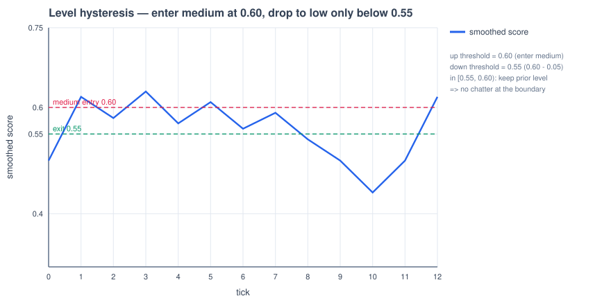

A score hovering at 0.60 (medium entry) no longer flaps to `low` on every dip — it stays
`medium` until it drops below `0.55`.

**(c) Critical fast-attack** — critical is latched off the **raw** score, not the smoothed
one:

```python
if raw_score >= thresholds['critical']:
    smoothed = raw_score        # snap up: OOM reaction never waits on the EWMA,
    level = "critical"          # and the reported score matches the "critical" label
```

This keeps OOM protection instantaneous and keeps the gauge's number consistent with its
label. Descent from critical is still EWMA-smoothed (fast-attack / slow-release).

**Refresh cadence** (`SystemPressureMonitor`): the normal interval is
`regular_update_sys_pressure_time` (5 s), tightening to `_FAST_PRESSURE_UPDATE` (2 s) once
memory usage enters `memory_busy_threshold − _FAST_ZONE_MEM_MARGIN` (i.e. ≥ 60 % used by
default), so a run toward OOM is caught within a couple of seconds. Both channels are
evaluated on that tick.

---

# Part II — The system channel

## 5. Memory scarcity gate (the sigmoid)

Memory is **not** driven by PSI. Memory PSI is unreliable here: it saturates to ~1.0 from
`MemoryHigh` reclaim churn while RAM is still ample (over-report), yet can read ~0 at
near-OOM before thrashing starts (under-report). Instead memory pressure is derived
**directly from the free-RAM ratio** with a logistic (sigmoid) gate:

$$
m = \frac{1}{1 + e^{x}},
\qquad
x = \frac{a - c}{c}\cdot k,
\qquad
c = 1 - \frac{T_{\mathrm{mem}}}{100}
$$

where $m\equiv$ `mem_scarcity`, $a\equiv$ `available_ratio`, and $T_{\mathrm{mem}}\equiv$ `memory_busy_threshold`.

- `c` = **center** = free-RAM ratio at the "busy" point (shipped busy 80 % → `c = 0.2`).
- `k` = `mem_gate_steepness` (shipped **8**, same as the in-code fallback).
- At the center, `x = 0` → `mem_scarcity = 0.5`. It is ~0 while RAM is ample and rises
  smoothly toward 1 as free RAM runs out. Continuous and differentiable — no hard step.

This is availability-driven, so it reads **identically before and after** a limit is
applied (memory scarcity is *never* discounted — that preserves OOM safety, since
`MemoryHigh` is only a soft cap).

### Effect of `mem_gate_steepness` (k)

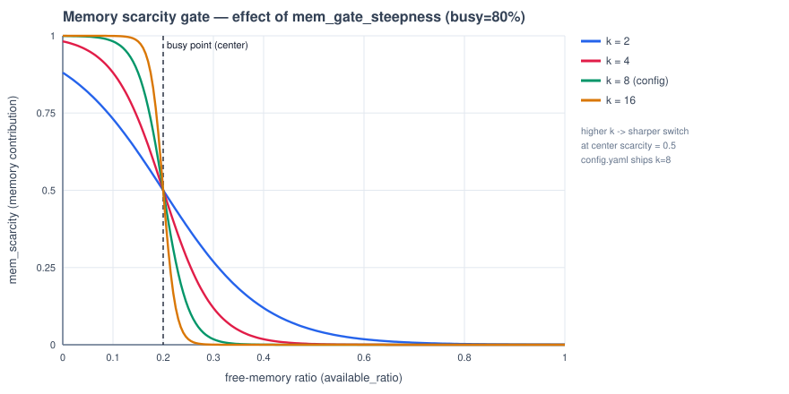

- Larger `k` → sharper, more switch-like transition around the busy point (fast escalation
  once RAM tips over, but less gradient to steer by).
- Smaller `k` → gentler ramp (earlier warning, softer landing).

**Why 8 and not 16.** `k` sets how many points of memory usage the `low → critical` traverse
is spread over, and that window is the balancer's entire time budget for acting gradually:

| `k` | `low → critical` spans | width of `medium` |
|---|---|---|
| **8** (shipped) | 81.0 % → 93.2 % (~12 points) | ~2.4 points |
| 16 | 80.5 % → 86.6 % (~6 points) | ~1.2 points |

The level is not the raw score — it is EWMA-smoothed (α = 0.3, effective memory ≈ 3.3 ticks)
and hysteresis-held (§4). At `k = 16` a normal memory ramp can cross `medium` in fewer ticks
than the filter needs to register it, so the smoothed score arrives at `critical` having
never reported `medium`: staged partial limiting is skipped and only the emergency step is
left. `k = 8` keeps the `medium` band wide enough that the filter can resolve it. Raise `k`
only if you want strictly binary behaviour (fine, or emergency) and no staged response.

### Effect of `memory_busy_threshold` (center shift)

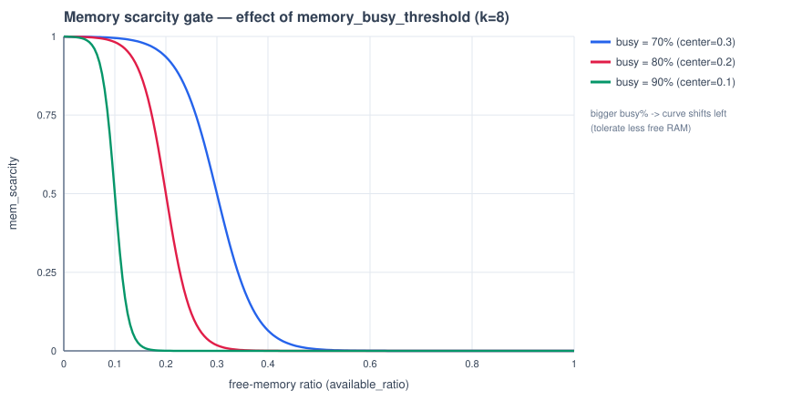

- Higher busy % → center moves **left** → the system tolerates less free RAM before
  memory pressure registers (curve shifts toward lower free-memory ratios).
- This is the single knob for "how full is *too full*".

---

## 6. Aggregation — normalized average + independent memory channel

$$
L = \frac{w_{\mathrm{cpu}}\,p^{\mathrm{eff}}_{\mathrm{cpu}} + w_{\mathrm{mem}}\,m + w_{\mathrm{io}}\,p^{\mathrm{eff}}_{\mathrm{io}}}{w_{\mathrm{cpu}} + w_{\mathrm{mem}} + w_{\mathrm{io}}}
$$

$$
\boxed{\ S = \min\bigl(\max(L,\ m),\ 1\bigr)\ }
$$

where $L\equiv$ `load` and $S\equiv$ final `score`.

Two design decisions live in this one line:

1. **Normalized average, not a raw sum.** A raw weighted sum let CPU (weight 1) add its
   full PSI, so `cpu 100%` alone reached ~0.7–0.9 ("high") even with RAM ample — which
   contradicts the intent that memory (weight 7) dominates and CPU saturation is benign.
   Dividing by `Σweights` keeps CPU/IO to their small share (`1/10` and `2/10` as shipped).
2. **Independent memory channel** (`max(load, mem_scarcity)`). Because the average caps
   memory's own contribution at `w_mem / Σweights` (`= 0.7` as shipped, `< 1`), a genuine
   near-OOM condition could never reach `critical` through the average alone. Flooring the
   score at `mem_scarcity` restores that: memory can drive the score to 1.0 on its own,
   while CPU/IO cannot.

### What the score does as memory fills

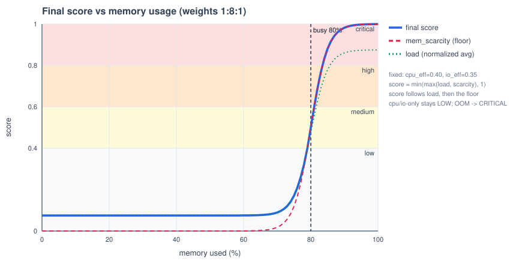

The figure sweeps memory usage with CPU/IO held at a **genuinely busy** `cpu_eff = 0.40`,
`io_eff = 0.35`. Three curves, and the score is always the higher of the other two:

| curve | what it is |
|---|---|
| 🔵 `final score` (thick) | `min(max(load, mem_scarcity), 1)` — what the balancer acts on |
| 🔴 `mem_scarcity` (dashed) | the §5 sigmoid; also the **floor** under the score |
| 🟢 `load` (dotted) | the normalized weighted average of all three inputs |

Read it in three parts:

1. **0 → ~79 % used: a flat line at 0.11.** `mem_scarcity` is ~0, so the score is
   just `load`, and `load` can't get anywhere: CPU and IO together own only
   `(w_cpu + w_io) / Σweights = 3/10` of the average, so even a busy CPU *and* a busy disk
   cap out around 0.11. **A CPU/IO-bound job with RAM to spare can never trigger a limit** —
   that flat line is the whole point of the normalized average.
2. **78.6 %: the floor takes over.** `mem_scarcity` overtakes `load` and the score switches
   from tracking the average to tracking memory — continuously, no step, no corner.
3. **79 → 93 %: the climb.** `medium` at **81.0 %**, `high` at **83.4 %**, `critical` at
   **93.2 %** (all at the shipped `k = 8`).

The single most useful detail in the figure: the green `load` curve **flattens at 0.81** and
never reaches the top, because memory's share of the average is capped at `7/10`. Without
the floor, a machine one allocation away from an OOM kill would still report `high`. The red
floor is what punches through that ceiling — and it is also why `load` is worth plotting at
all.

Net behaviour: CPU/IO-only load (RAM fine) → **low**, won't auto-throttle. RAM at the busy
point (80 %) → score 0.50, still **low** — about a point of usage short of `medium`. RAM near
OOM → **critical**.

---

## 7. Worked examples

At the shipped `weights = 1:7:2` and `mem_gate_steepness = 8`:

| Scenario | `psi` cpu/io | RAM used | `mem_scarcity` | `load` | **score** | level |
|---|---|---|---|---|---|---|
| Idle | 0.02 / 0.0 | 12 % | ~0 | 0.002 | **0.00** | low |
| 1× `stress` (cpu 100 %) | 0.68 / 0.20 | 50 % | ~0 | 0.108 | **0.11** | low |
| 2× limited, RAM moderate | 0.66 / 0.44¹ | 75 % | 0.119 | 0.237 | **0.24** | low |
| At busy point | 0.6 / 0.4 | 80 % | 0.500 | 0.490 | **0.50** | low² |
| Just past busy | 0.6 / 0.4 | 81 % | 0.599 | 0.559 | **0.60** | medium |
| Deep in the ramp | 0.5 / 0.3 | 92 % | 0.992 | 0.804 | **0.99** | high³ |
| Near-OOM | 0.5 / 0.3 | 95 % | 0.998 | 0.808 | **1.00** | critical |

¹ discounted by `self_fraction` before entering `load`.
² the busy point is where `mem_scarcity = 0.5` **by definition** (§5), and 0.5 is inside the
`low` band (§4). "Busy" is where memory *starts counting*, not where it escalates; escalation
follows about a point of usage later.
³ `critical` needs the score to *top out* (§4), so the last stretch of the sigmoid — 93 % up —
is what `critical` costs. 92 % is `high`: armed and already being acted on, but not the
emergency band. That gap is the staged-response window `k = 8` buys.

The middle rows are exactly the cases that used to mis-read (`cpu 100%` → "high";
`2× limited` → stuck "critical") before the normalized-average + independent-memory-channel
change.

---

## 8. Reading the `[sys-level]` line

The channel prints **one line per tick**, INFO once it is out of `low` and DEBUG while it
is quiet.

```
[sys-level] level=low score=0.12 raw=0.12 | load=0.119 = w-avg(cpu 0.350, mem 0.000, io 0.420)
            w=1:7:2 | mem_scarcity=0.000 (free 29%) | cpu 78% mem 71%
```

| Field | Meaning |
|---|---|
| `level` | the emitted band, after EWMA + hysteresis (§4) — what the balancer acts on |
| `score` | the smoothed score behind `level`; this is what the UI gauge shows |
| `raw` | this tick's unsmoothed score. `raw` alone latches `critical`; a gap between the two is the EWMA still catching up |
| `load` | the normalized weighted average of the three inputs — the `w-avg(...)` right after it is those inputs, already self-discounted (§3) |
| `w=1:7:2` | the live `cpu:memory:io` weights, re-read from `config.yaml` every tick |
| `mem_scarcity` | the memory gate (§5): ~0 while RAM is ample, →1 as free RAM runs out. It is both the `mem` term in the average **and** a floor under `score` |
| `free N%` | free-RAM ratio — the only input `mem_scarcity` has |
| `cpu N% mem N%` | plain utilisation, for context only; nothing is computed from them |
| `self_disc …` | only printed when a limited app is dominant: the fraction of CPU/IO stall attributed to it and discounted (§3) |

---

## 9. Why memory is special

| Resource | Limit type | Signal | Discounted when limited? | Can reach critical alone? |
|---|---|---|---|---|
| CPU | `cpu.max` (hard) | system PSI | yes (`_CPU_IO_SELF_GATE`) | no (normalized to a small share) |
| IO (system channel) | `io.max` (hard) | system PSI | yes (`_CPU_IO_SELF_GATE`) | no |
| Memory | `MemoryHigh` (soft) | availability sigmoid | **no** (OOM safety) | **yes** (`max(load, mem_scarcity)`) |
| Disk IO (own channel, Part III) | `io.max` (hard) | USE model **×** io PSI | yes (`_CPU_IO_SELF_GATE`) | **yes** — via `disk_thresholds`, not the system score |

CPU/IO are hard-capped, so a limited app can't drive the machine to catastrophe — its
self-inflicted stall is safe to discount. Memory's soft cap can still be exceeded, so its
scarcity is never discounted and retains an independent path to `critical`.

Memory and disk IO both need a path to `critical` that the weighted average cannot give
them, and they get it in different ways for different reasons: memory floors the system
score (`max(load, mem_scarcity)`) because an OOM kill is a system-wide event; disk IO gets
a whole separate channel because a saturated disk is *not* a system-wide emergency and must
not lift the system score at all — it only needs to authorize an `io.max` cap.

---

# Part III — The disk-IO channel

## 10. Why disk IO needs its own channel

Disk IO cannot ride on the system score. With `weights.io = 2` out of `Σweights = 10`, the io
term contributes at most `0.2` (§6) — a disk can be completely saturated and the system score
still reads `low`. That is correct for the system channel (a busy disk is not an emergency)
but useless for deciding `io.max` caps, which need their own trigger.

So the disk channel is a parallel pipeline: its own saturation model, its own bands
(`disk_thresholds`, never the system `thresholds`), and its own EWMA + hysteresis state
(§4). Its output is a `disk_level`, and `critical` on that level is what makes the balancer
write `io.max` (`_handle_disk_io_stressed`).

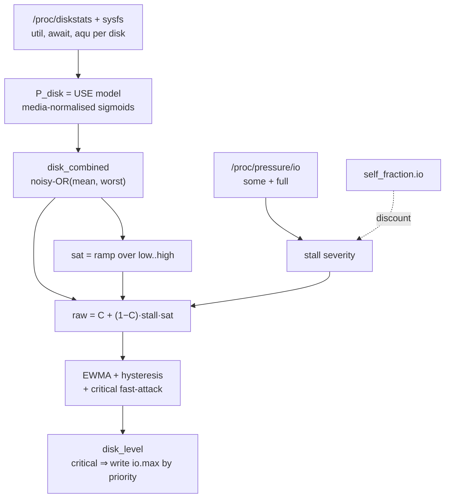

The shape of the whole thing is one sentence: **`disk_combined` says how saturated the
disk is, the io PSI says whether that saturation is actually stalling work, and only the
product of the two reaches `critical`.**

---

## 11. Per-disk pressure — the USE model

Each disk gets a pressure in `[0, 1]` from three sub-signals (utilisation, saturation,
latency — the USE method), each squashed by a logistic:

$$
P_{\mathrm{disk}} = A\bigl(w_{\mathrm{lat}}\,\sigma(\text{await}) + w_{q}\,\sigma(\text{aqu})\bigr) + w_{\mathrm{util}}\,\sigma(\text{util})
$$

$$
\sigma(x) = \frac{1}{1 + e^{-k\left(\frac{x}{x_{1/2}} - 1\right)}},
\qquad
A = \min\!\left(1,\ \frac{\text{util}}{\text{util}_{\mathrm{act}}}\right)
$$

| Term | Source | Default weight |
|---|---|---|
| `await` (ms) | Δ`io_time` ÷ Δ`ops` — mean per-IO latency | `latency: 0.55` |
| `aqu` | Δ(diskstats field 14) ÷ Δt — mean queue depth (Little's law) | `queue: 0.35` |
| `util` (%) | Δ`io_ticks` ÷ Δt — time with ≥1 IO in flight | `util: 0.10` |

- **Latency dominates** because it is what users feel.
- **`util` is only a tie-breaker.** It measures "time with ≥1 IO in flight", which says
  nothing about remaining concurrency: an NVMe sits at 100 % util with one request
  outstanding and enormous headroom. Treat a high util alone as "active", never as "full".
- **`A` is the activity gate.** On an NVMe (await half-point 1 ms) a couple of background
  ops on an otherwise idle disk would pin the latency term at 1.0; scaling latency and
  queue by util (relative to `activity_util_pct`, default 20 %) makes an idle disk read ~0
  regardless of per-op latency.

### Media-aware half-points

Every `_half` is the metric value that reads as **0.5**, and every one of them is per
**media class** — that is where "busy" is made relative to what the hardware can sustain:

| media | `await_half_ms` | `queue_half` | `util_half_pct` |
|---|---|---|---|
| `nvme` | 1.0 | 32 | 95 |
| `sata_ssd` | 5.0 | 16 | 85 |
| `hdd` | 20.0 | 3 | 80 |
| `usb` | 30.0 | 1 | 80 |

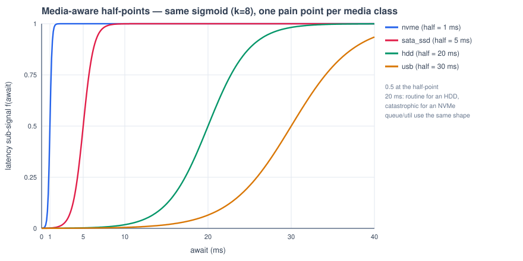

A 20 ms await is routine for an HDD and catastrophic for an NVMe — same curve, different
pain point. Two consequences worth knowing:

- Because `P_disk` comes out **media-normalised**, the thresholds applied to it are
  deliberately media-agnostic. Per-media bands *and* per-media half-points would apply the
  correction twice.
- Media is detected from sysfs facts, and USB is checked **before** the rotational flag:
  USB mass storage reports `rotational=0` and would otherwise be judged by SSD latency —
  the single worst misclassification available, since the two differ by an order of
  magnitude in what counts as slow.
- `queue_half` is the only half-point a device can lower for itself: a disk advertising
  `device/queue_depth` below the class default (USB bridges report 1) uses its own value.
  Probing never *raises* it above the class pain point, because the advertised depth is
  capacity, not the depth at which latency starts to hurt.

---

## 12. Aggregation — noisy-OR of the mean and the worst disk

$$
C = 1 - (1 - \bar{P})\,(1 - P_{\max} w_{\max})
$$

where $C\equiv$ `disk_combined`, $\bar P\equiv$ `avg_p` over all physical disks,
$P_{\max}\equiv$ `max_p`, and $w_{\max}\equiv$ `max_p_weight` (shipped **0.8**, same as the
in-code fallback).

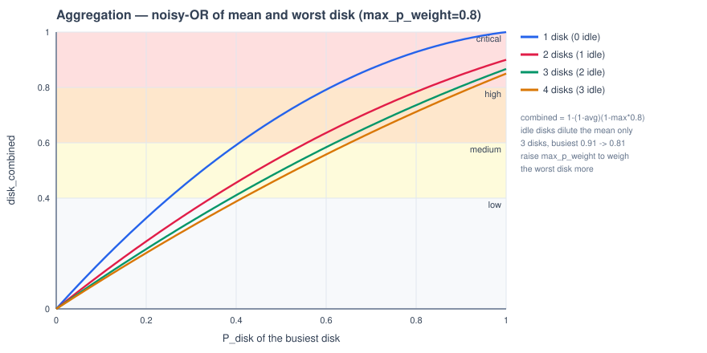

A plain mean would average one hammered disk away behind idle ones; taking only the worst
would ignore breadth. The noisy-OR keeps both: the mean carries "how much of the storage
subsystem is busy", the max term guarantees a single saturated disk still lands high.

On a box with three physical disks where only one is loaded, a `P_disk` of **0.91** yields
`C ≈ 0.81` — the two idle disks cost about 0.1 of aggregate pressure. That is the intended
dilution, but it also means `C` sits just past the `high` band edge on such a box; if one
saturated disk out of N should count for more, raise `max_p_weight`.

> ### Why `max_p_weight` cannot go much below 0.8
>
> The dilution is not only a shift in sensitivity — it puts a **ceiling** on `C`. With `N`
> physical disks and even the worst one fully saturated (`P_disk = 1`), `C` tops out at
> `1 − (1 − 1/N)(1 − w_max)`, which falls as `N` grows. Reaching `critical` needs `sat = 1`,
> i.e. `C ≥ disk_thresholds.high` (0.8), so a box can only ever throttle if
>
> $$w_{\max} \ \ge\ 1 - \frac{0.2\,N}{N-1}$$
>
> — **≥ 0.70 for 3 disks, ≥ 0.73 for 4, ≥ 0.75 for 5, rising to 0.8 as `N → ∞`.** The shipped
> **0.8** is therefore the lowest value that keeps `io.max` reachable on a machine with *any*
> number of disks: at 0.8 a fully saturated worst disk gives `C = 0.87` on 3 disks and `0.83`
> on 6, both clear of the 0.8 that `sat = 1` needs.
>
> Lowering it does not just damp the aggregate, it can make `critical` **unreachable** — at
> 0.65, for instance, `C` caps at 0.77 on a 3-disk box, so `disk_level` never leaves `high`
> and `io.max` is never written no matter how hard one disk is hammered. Check the bound above
> against the disk count of the target machines before going below 0.8, or lower
> `disk_thresholds.high` to move the `sat = 1` point down with it.

---

## 13. The PSI gate — saturation × stall

`disk_combined` alone would throttle any app that merely keeps a disk busy. The io PSI is
what turns "the disk is working hard" into "the disk is hurting the system".

$$
\text{stall} = \min\bigl(1,\ w_{s}\,p^{\mathrm{io}}_{\mathrm{some}} + w_{f}\,p^{\mathrm{io}}_{\mathrm{full}}\bigr)
$$

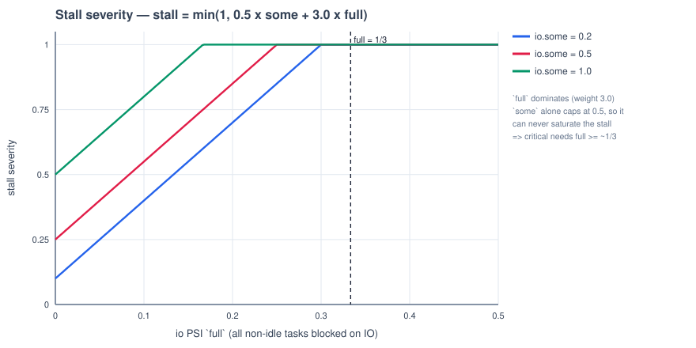

- `full` = *every* non-idle task is blocked on IO. Strongest signal, but on a multi-core
  box one CPU-bound thread drives it to 0, so it is rare — hence weight **3.0**.
- `some` = at least one task blocked. Common under any real disk load, so weight **0.5**:
  since `some ≤ 1`, that term alone tops out at 0.5 and can never saturate the stall.
- Net effect: **`critical` effectively requires `io.full ≳ 1/3`.** If a workload keeps a
  disk pinned but never blocks a task (async O_DIRECT that always finds a free tag), the
  level correctly stops at `high`.

Then saturation is turned into a ramp, and the PSI is allowed to fill only the headroom
`disk_combined` has left:

$$
\text{sat} = \operatorname{clamp}\!\left(\frac{C - T_{\text{low}}}{T_{\text{high}} - T_{\text{low}}},\ 0,\ 1\right)
\qquad
\boxed{\ \text{raw} = C + (1 - C)\cdot\text{stall}\cdot\text{sat}\ }
$$

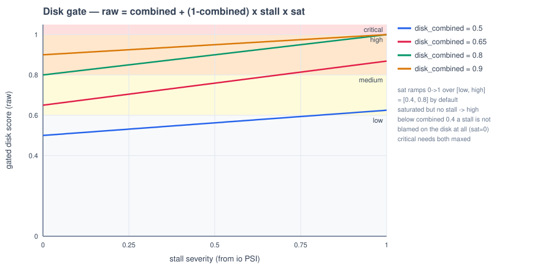

Monotone and continuous in **both** signals, which is what keeps the level from jumping
straight from `medium` to `critical`:

| | no task stall | system-wide IO stall |
|---|---|---|
| disk not saturated (`C < low`) | `low` | `low` — `sat = 0`, so the stall is not blamed on the local disk (a network fs, a stuck USB device) |
| disk saturated (`C ≥ high`) | **`high`** — armed: the top consumer is identified and logged, nothing is throttled | **`critical`** — throttle |

Note the corollary in the figure: with `C ≈ 0.81` (the 3-disk box above) `sat` is already 1,
so `raw` reaches 1.00 exactly when `stall` does. The saturation side of this gate has enormous
headroom on a deep-queue workload — `σ` is long since saturated — so in practice **it is the
PSI that decides the level**, and `disk_combined` just decides whether the PSI is allowed to
count. The one way to break that is to lower `max_p_weight` far enough that `C` can no longer
reach `disk_thresholds.high` on the machine's disk count; then `sat < 1` and saturation
becomes the binding constraint instead (see the box in §12).

### 13.1 Self-inflicted discount

The same `_CPU_IO_SELF_GATE` (§3) applies here, logged as `io_self_disc`: once an app has
been capped, its tasks stall against their *own* `io.max`, and that stall must not be read
as fresh system-wide pressure — otherwise the first cap guarantees a second one.

$$
p^{\mathrm{io}}_{\{\mathrm{some},\,\mathrm{full}\}} \mathrel{{\times}{=}} \bigl(1 - f_{\mathrm{io}}\,g\bigr)
$$

---

## 14. What the level drives

| `disk_level` | balancer behaviour |
|---|---|
| `low` / `medium` | nothing; `medium` marks a disk `is_busy` for the UI breadth report |
| `high` | **armed**: the top disk-IO consumers are resolved and logged (`[disk-io]`), no cap is written |
| `critical` | cap the top throttleable consumer with `io.max` at its priority's rates, scoped to `stressed_disks`; `Critical`-priority and already-capped apps are skipped |

Restore is driven by the *system* level, not this one (partial at `medium`, full at `low`,
each after a stable period), plus a reaper that lifts the cap as soon as the app exits.

For what those caps do to measured throughput — and how much of a saturated device a
Critical app ends up holding — see
[Disk I/O under pressure](disk_io_throttle_results.md).

---

## 15. Reading the `[disk-level]` line

Like the system channel, one line per tick, INFO out of `low` and DEBUG while quiet. A
third tag, `[disk-io]`, appears only when the balancer acts (candidate list, why each was
skipped, the cap applied).

```
[disk-level] level=high score=0.93 raw=0.93 | combined=0.830 sat=1.00 stall=0.59
             (io some=0.350 full=0.140 self_disc=1.00) | nvme0n1(nvme) p=0.936 util=88%
             await=159.2ms aqu=5814 rd=0 wr=147 MB/s | for critical: stall>=1.00 (io.full>=0.275)
```

`level` / `score` / `raw` mean exactly what they do in §8, on the disk channel's own state.

| Field | Meaning |
|---|---|
| `combined` | how saturated the disk subsystem is, 0–1, from the USE model + noisy-OR (§11, §12). Media-normalised, so 0.83 means the same on an HDD and an NVMe |
| `sat` | how much of the stall we are willing to **blame on the disk**: 0 below the `low` band, 1 at/above `high`. A stalling but unsaturated disk has `sat=0` and cannot lift the score |
| `stall` | how badly IO is actually blocking work, from the io PSI: `0.5·some + 3·full`, capped at 1 |
| `some` / `full` | the raw io PSI inputs. `some` = at least one task blocked, `full` = *every* runnable task blocked. `full` is weighted 6× because only it means the machine as a whole is stuck |
| `self_disc` | 1.00 = no discount. Below 1, part of the PSI was attributed to an already-limited app stalling on its own cap and removed (§13.1) |
| per-disk block | the busy disks, busiest first: `p` = that disk's pressure, then the raw sub-signals — `util` %, `await` mean per-IO latency, `aqu` mean queue depth, and throughput. `(nvme)` is the detected media class, which picks the half-points |
| `for critical: …` | printed only at `high` (armed, not throttling): the `stall` — and the `io.full` behind it — still needed to cross `critical` at this saturation |

The score itself is `raw = combined + (1 − combined)·stall·sat` (§13): saturation sets the
level, PSI lifts it within the remaining headroom, and `sat` decides whether that lift is
allowed at all.

---

# Appendix — Parameter reference

System channel and shared machinery:

"Shipped" is the value in `config/config.yaml` — what actually runs. Where the in-code
fallback (`config/config.py`) differs it is noted, since that is what applies if the key is
deleted; `thresholds`, `weights` and `disk_thresholds` have no fallback at all and must be
present.

| Parameter | Where | Shipped | Increase it → | Decrease it → |
|---|---|---|---|---|
| `weights.{cpu,memory,io}` | `config.yaml` | `1 / 7 / 2` | that resource weighs more in `load` | weighs less |
| `thresholds.{low,medium,high,critical}` | `config.yaml` | `0.4/0.6/0.8/1.0` | levels harder to reach | easier to reach. `low` is inert on this channel (§4) |
| `memory_busy_threshold` | `config.yaml` | `80` (fallback `90`) | tolerate less free RAM (curve ← ) | escalate earlier |
| `mem_gate_steepness` (`k`) | `config.yaml` | `8` | sharper OOM switch, narrower `medium` window (16 ⇒ ~1.2 points wide — the EWMA can miss it, §5) | gentler ramp, more time to steer |
| `_CPU_IO_SELF_GATE` | `pressure.py` | `0.7` | more discount → lower post-limit score | less discount → higher |
| `_SCORE_EWMA_ALPHA` | `pressure.py` | `0.3` | faster / noisier level | smoother / laggier |
| `_LEVEL_HYSTERESIS` | `pressure.py` | `0.05` | stickier levels (less flapping, more lag) | more responsive, more chatter |
| `_FRAC_EWMA_ALPHA` | `psi.py` | `0.3` | faster / noisier discount | smoother / laggier |
| `regular_update_sys_pressure_time` | `config.yaml` | `5` s | slower sampling | faster sampling |

Disk channel (Part III) — all under `config.yaml`, re-read every tick, no restart needed:

| Parameter | Shipped | Increase it → | Decrease it → |
|---|---|---|---|
| `disk_thresholds.{low,medium,high,critical}` | `0.4/0.6/0.8/1.0` | disk levels harder to reach; `high` also raises the `sat=1` point | easier; `low`/`high` narrow the saturation ramp |
| `disk_psi_weights.{some,full}` | `0.5 / 3.0` | less task stall needed for `critical` | more stall needed |
| `disk_pressure_model.sub_weights.{latency,queue,util}` | `0.55/0.35/0.10` | that sub-signal dominates `P_disk` | it matters less |
| `disk_pressure_model.sigmoid_k` | `8.0` | sharper, more switch-like at the half-point | gentler ramp |
| `disk_pressure_model.{await_half_ms,queue_half,util_half_pct}` | per media class | the same hardware state reads as **less** pressure | as more pressure |
| `disk_pressure_model.activity_util_pct` | `20` % | more util required before await/queue count | idle-disk noise counts sooner |
| `disk_pressure_model.max_p_weight` | `0.8` | the single worst disk dominates the aggregate | the mean dominates — **and caps `C`; below `1 − 0.2N/(N−1)` an N-disk box can never reach `critical`, so 0.8 is the safe floor** (§12) |

## Tuning cheat-sheet

- **"CPU-heavy jobs shouldn't trigger throttling"** — already handled by the normalized
  average; if needed, lower `weights.cpu` further.
- **"React to OOM sooner"** — raise `memory_busy_threshold` (shifts the curve left) and/or
  lower `mem_gate_steepness` for an earlier ramp.
- **"Level flaps between medium/low"** — raise `_LEVEL_HYSTERESIS` or lower
  `_SCORE_EWMA_ALPHA`.
- **"App keeps getting re-limited after a limit"** — raise `_CPU_IO_SELF_GATE` (discount
  more of its self-inflicted stall).
- **"The disk is clearly saturated but never reaches critical"** — read `stall` in the
  `[disk-level]` log line. A workload that keeps the queue full without ever blocking a task
  produces `io.full ≈ 0`; that is the gate working, not a bug. Raise
  `disk_psi_weights.some` only if measurements show `full` staying low while `some` is high.
- **"One hammered disk out of several doesn't register"** — that is the mean diluting it
  (§12); raise `disk_pressure_model.max_p_weight`.
- **"`disk_level` sticks at `high` and never throttles on a multi-disk box"** — check
  `combined` in the `[disk-level]` line while one disk reads `p ≈ 1`. If it plateaus *below*
  `disk_thresholds.high` (0.8), the aggregate is **capped**, not merely damped, and no amount
  of io PSI can reach `critical`. Compare `max_p_weight` against `1 − 0.2N/(N−1)` for the
  machine's disk count (§12) — the shipped 0.8 clears it for every N; 0.65 would fail on any
  box with ≥ 3 disks.
- **"`medium` flashes past straight into `critical` as RAM fills"** — that is
  `mem_gate_steepness` too high compressing the traverse (16 ⇒ ~6 points of usage, `medium`
  only ~1.2 wide, §5); the shipped 8 gives ~12 and ~2.4.
- **"A USB disk / an HDD reads as permanently saturated"** — check `disk_type` in the
  `[disk-level]` line first (misdetected media applies the wrong half-points), then the
  half-points for that class.
