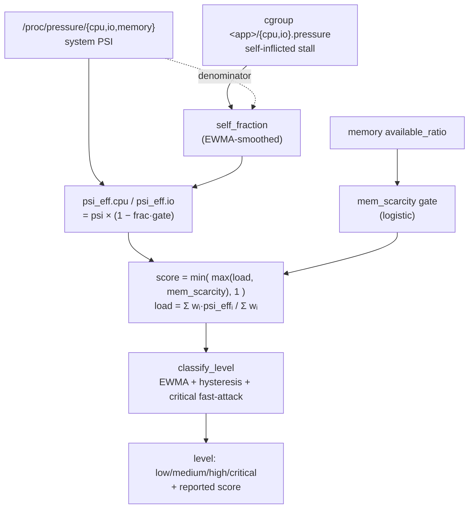

<!-- Copyright (c) 2026 Intel Corporation -->
<!-- SPDX-License-Identifier: Apache-2.0 -->

# System Pressure Model

How SmarTune turns raw kernel signals into a single **pressure score** and a
**pressure level** (`low / medium / high / critical`) that drives auto-throttling
and staged restore.

- Score math: [`monitor/pressure.py`](../monitor/pressure.py) (`PressureAnalyzer`)
- Signal collection & attribution: [`monitor/psi.py`](../monitor/psi.py) (`PSIMonitor`)
- Orchestration / refresh cadence: [`monitor/monitor_api.py`](../monitor/monitor_api.py) (`SystemPressureMonitor`)

> Figures are regenerated by [`pressure_model_figures.py`](pressure_model_figures.py)
> (`python3 docs/pressure_model_figures.py`). Re-run it whenever a default changes.

---

## 1. Pipeline at a glance



Every ~5 s (tightening to ~2 s near OOM — see §7) the monitor samples the signals,
computes a **raw score**, then smooths it into a **level**. The raw score reacts
instantly; the level is deliberately stabilized so the balancer's restore timer can
converge.

---

## 2. Inputs

| Symbol | Source | Meaning |
|---|---|---|
| `psi.cpu`, `psi.io`, `psi.memory` | `/proc/pressure/*` (`some`, rolling avg) | fraction of time **some** task stalled on that resource, `0..1` |
| `self_fraction.cpu/io` | per-cgroup `*.pressure` ÷ system PSI | share of the stall caused by the **already-limited** app(s), `0..1` |
| `available_ratio` | `MemAvailable / MemTotal` | free-memory ratio, `0..1` |
| `weights` | `config.yaml` → `weights` | relative importance, default `cpu:1, memory:8, io:1` |
| `thresholds` | `config.yaml` → `thresholds` | level cut-offs, default `0.4 / 0.6 / 0.8 / 1.0` |

**Why PSI and not CPU%?** PSI measures *stall* (contention), not utilization. CPU at
100% with no one waiting is benign; PSI stays low. That distinction is the whole point
of the model — see §6.

---

## 3. Self-inflicted discount (CPU / IO)

When an app is **already rate-limited** but still the top consumer, throttling it
*inflates* PSI (its tasks stall against their own `cpu.max` / `io.max`) even though the
rest of the machine has headroom. We remove only the portion of the stall that the
limited app itself caused.

$$
\text{psi\_eff}_{r} = \text{psi}_{r}\;\bigl(1 - \text{self\_fraction}_{r}\cdot \text{gate}\bigr)
\qquad r \in \{\text{cpu}, \text{io}\}
$$

- `gate` = `_CPU_IO_SELF_GATE` (default **0.7**).
- `self_fraction` is only non-zero when a limited app is dominant; otherwise no discount.

**`self_fraction` itself** (`PSIMonitor.get_self_inflicted_fraction`):

$$
\text{self\_fraction}_{r} = \min\!\Bigl(1,\ \frac{\sum_{\text{limited cg}} \text{stall\_rate}_{cg,r}}{\text{stall\_rate}_{\text{system},r}}\Bigr)
$$

computed from the `some total` delta of each cgroup's `*.pressure` file vs the system
PSI file, then **EWMA-smoothed** (§5). It is attribution by *pressure*, not throughput —
a byte/CPU-time share was tried and was worse for stall-driven loads (e.g. `stress --io`
generates IO-wait via `sync()` while moving ~no bytes, collapsing a byte-share to zero).

### Effect of `_CPU_IO_SELF_GATE`


| gate | behaviour | risk |
|---|---|---|
| `0.0` | keep all stall (no discount) | post-limit score stays high → keeps re-limiting |
| `0.7` (default) | remove 70 % of the self-share | lands post-limit pressure in the stable medium band |
| `1.0` | remove all self-share | can drop to "low" → premature full restore → limit/restore **flapping** |

Lower gate → less discount → higher score. Higher gate → more discount → lower score.

---

## 4. Memory scarcity gate (the sigmoid)

Memory is **not** driven by PSI. Memory PSI is unreliable here: it saturates to ~1.0 from
`MemoryHigh` reclaim churn while RAM is still ample (over-report), yet can read ~0 at
near-OOM before thrashing starts (under-report). Instead memory pressure is derived
**directly from the free-RAM ratio** with a logistic (sigmoid) gate:

$$
\text{mem\_scarcity} = \frac{1}{1 + e^{x}},
\qquad
x = \frac{\text{available\_ratio} - c}{c}\cdot k,
\qquad
c = 1 - \frac{\text{memory\_busy\_threshold}}{100}
$$

- `c` = **center** = free-RAM ratio at the "busy" point (default busy 80 % → `c = 0.2`).
- `k` = `mem_gate_steepness` (default **8**).
- At the center, `x = 0` → `mem_scarcity = 0.5`. It is ~0 while RAM is ample and rises
  smoothly toward 1 as free RAM runs out. Continuous and differentiable — no hard step.

This is availability-driven, so it reads **identically before and after** a limit is
applied (memory scarcity is *never* discounted — that preserves OOM safety, since
`MemoryHigh` is only a soft cap).

### Effect of `mem_gate_steepness` (k)


- Larger `k` → sharper, more switch-like transition around the busy point (fast escalation
  once RAM tips over, but less gradient to steer by).
- Smaller `k` → gentler ramp (earlier warning, softer landing).

### Effect of `memory_busy_threshold` (center shift)


- Higher busy % → center moves **left** → the system tolerates less free RAM before
  memory pressure registers (curve shifts toward lower free-memory ratios).
- This is the single knob for "how full is *too full*".

---

## 5. Aggregation — normalized average + independent memory channel

$$
\text{load} = \frac{w_{\text{cpu}}\cdot\text{psi\_eff}_{\text{cpu}} + w_{\text{mem}}\cdot\text{mem\_scarcity} + w_{\text{io}}\cdot\text{psi\_eff}_{\text{io}}}{w_{\text{cpu}} + w_{\text{mem}} + w_{\text{io}}}
$$

$$
\boxed{\ \text{score} = \min\bigl(\max(\text{load},\ \text{mem\_scarcity}),\ 1\bigr)\ }
$$

Two design decisions live in this one line:

1. **Normalized average, not a raw sum.** A raw weighted sum let CPU (weight 1) add its
   full PSI, so `cpu 100%` alone reached ~0.7–0.9 ("high") even with RAM ample — which
   contradicts the intent that memory (weight 8) dominates and CPU saturation is benign.
   Dividing by `Σweights` keeps CPU/IO to their small share (`1/10` each by default).
2. **Independent memory channel** (`max(load, mem_scarcity)`). Because the average caps
   memory's own contribution at `w_mem / Σweights` (`= 0.8` by default, `< 1`), a genuine
   near-OOM condition could never reach `critical` through the average alone. Flooring the
   score at `mem_scarcity` restores that: memory can drive the score to 1.0 on its own,
   while CPU/IO cannot.

### What the score does as memory fills


With CPU/IO fixed, the score tracks the **normalized load** while RAM is ample (staying
LOW), then the **mem_scarcity floor** takes over past the busy point and carries it up to
CRITICAL near OOM. Net behaviour:

- CPU/IO-only load (RAM fine) → **LOW** (won't auto-throttle).
- RAM at the busy point (≈80 %) → **medium**.
- RAM near OOM → **critical**.

---

## 6. Worked examples

| Scenario | `psi` cpu/io | RAM used | `mem_scarcity` | `load` | **score** | level |
|---|---|---|---|---|---|---|
| Idle | 0.02 / 0.0 | 12 % | ~0 | 0.002 | **0.00** | low |
| 1× `stress` (cpu 100 %) | 0.68 / 0.20 | 50 % | ~0 | 0.088 | **0.09** | low |
| 2× limited, RAM moderate | 0.66 / 0.44¹ | 75 % | 0.12 | 0.16 | **0.16** | low |
| At busy point | 0.6 / 0.4 | 80 % | 0.50 | 0.50 | **0.50** | medium |
| Near-OOM | 0.5 / 0.3 | 92 % | 0.99 | ~0.86 | **0.99** | critical |

¹ discounted by `self_fraction` before entering `load`.

The middle rows are exactly the cases that used to mis-read (`cpu 100%` → "high";
`2× limited` → stuck "critical") before the normalized-average + independent-memory-channel
change.

---

## 7. Level classification — smoothing, hysteresis, fast-attack

`calculate_pressure_score` returns the **raw** score; `classify_level` turns a stream of
raw scores into a **stable level** plus the smoothed score that is reported to the UI.

**(a) EWMA smoothing** of the sub-critical score:

$$
s_t = \alpha\,x_t + (1-\alpha)\,s_{t-1},\qquad \alpha = \text{\_SCORE\_EWMA\_ALPHA} = 0.3
$$

A first-order IIR low-pass filter. Weight on the sample `k` ticks ago is `α(1−α)^k`
(geometric decay); effective memory ≈ `1/α ≈ 3.3` ticks (~15 s at a 5 s cadence).


- Smaller `α` → smoother but slower to react.
- Larger `α` → faster but noisier.
- The raw score's tick-to-tick swing (cpu PSI jumping 0.2↔0.85) is what smoothing removes;
  without it the level chattered across a threshold every few seconds and reset the
  balancer's restore timer.

> **Adaptive / sigmoid α was evaluated and rejected**: on real logs the noise is
> stationary, so an adaptive α averaged 0.335 ≈ the fixed 0.30 with no gain, and would
> re-introduce chatter by chasing normal noise. Fixed α + hysteresis + fast-attack covers
> the one regime change that matters (critical) directly.

**(b) Hysteresis** — downgrades are sticky, upgrades are immediate:

- To *enter* a higher level: cross its threshold (immediate).
- To *leave* the current level downward: the smoothed score must fall a full
  `_LEVEL_HYSTERESIS` (**0.05**) **below** that level's entry threshold.


A score hovering at 0.60 (medium entry) no longer flaps to `low` on every dip — it stays
`medium` until it drops below `0.55`.

**(c) Critical fast-attack** — critical is latched off the **raw** score, not the smoothed
one:

```python
if raw_score >= thresholds['critical']:
    smoothed = raw_score        # snap up: OOM reaction never waits on the EWMA,
    level = "critical"          # and the reported score matches the "critical" label
```

This keeps OOM protection instantaneous and keeps the gauge's number consistent with its
label. Descent from critical is still EWMA-smoothed (fast-attack / slow-release).

**Refresh cadence** (`SystemPressureMonitor`): the normal interval is
`regular_update_sys_pressure_time` (5 s), tightening to `_FAST_PRESSURE_UPDATE` (2 s) once
memory usage enters `memory_busy_threshold − _FAST_ZONE_MEM_MARGIN` (i.e. ≥ 60 % used by
default), so a run toward OOM is caught within a couple of seconds.

---

## 8. Parameter reference

| Parameter | Where | Default | Increase it → | Decrease it → |
|---|---|---|---|---|
| `weights.{cpu,memory,io}` | `config.yaml` | `1 / 8 / 1` | that resource weighs more in `load` | weighs less |
| `thresholds.{low,medium,high,critical}` | `config.yaml` | `0.4/0.6/0.8/1.0` | levels harder to reach | easier to reach |
| `memory_busy_threshold` | `config.yaml` | `80` | tolerate less free RAM (curve ← ) | escalate earlier |
| `mem_gate_steepness` (`k`) | `config.yaml` | `8` | sharper OOM switch | gentler ramp |
| `_CPU_IO_SELF_GATE` | `pressure.py` | `0.7` | more discount → lower post-limit score | less discount → higher |
| `_SCORE_EWMA_ALPHA` | `pressure.py` | `0.3` | faster / noisier level | smoother / laggier |
| `_LEVEL_HYSTERESIS` | `pressure.py` | `0.05` | stickier levels (less flapping, more lag) | more responsive, more chatter |
| `_FRAC_EWMA_ALPHA` | `psi.py` | `0.3` | faster / noisier discount | smoother / laggier |
| `regular_update_sys_pressure_time` | `config.yaml` | `5` s | slower sampling | faster sampling |

### Tuning cheat-sheet

- **"CPU-heavy jobs shouldn't trigger throttling"** — already handled by the normalized
  average; if needed, lower `weights.cpu` further.
- **"React to OOM sooner"** — raise `memory_busy_threshold` (shifts the curve left) and/or
  lower `mem_gate_steepness` for an earlier ramp.
- **"Level flaps between medium/low"** — raise `_LEVEL_HYSTERESIS` or lower
  `_SCORE_EWMA_ALPHA`.
- **"App keeps getting re-limited after a limit"** — raise `_CPU_IO_SELF_GATE` (discount
  more of its self-inflicted stall).

---

## 9. Why memory is special (summary)

| Resource | Limit type | Signal | Discounted when limited? | Can reach critical alone? |
|---|---|---|---|---|
| CPU | `cpu.max` (hard) | system PSI | yes (`_CPU_IO_SELF_GATE`) | no (normalized to a small share) |
| IO | `io.max` (hard) | system PSI | yes (`_CPU_IO_SELF_GATE`) | no |
| Memory | `MemoryHigh` (soft) | availability sigmoid | **no** (OOM safety) | **yes** (`max(load, mem_scarcity)`) |

CPU/IO are hard-capped, so a limited app can't drive the machine to catastrophe — its
self-inflicted stall is safe to discount. Memory's soft cap can still be exceeded, so its
scarcity is never discounted and retains an independent path to `critical`.
